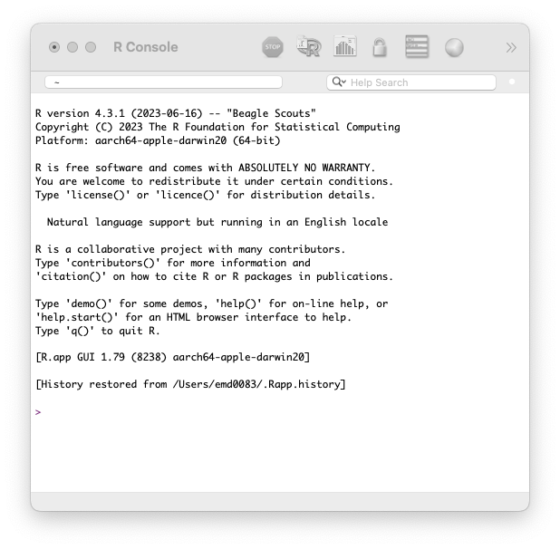
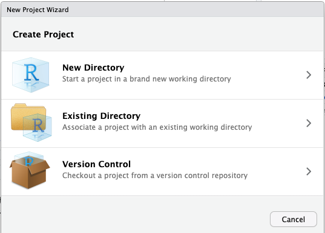
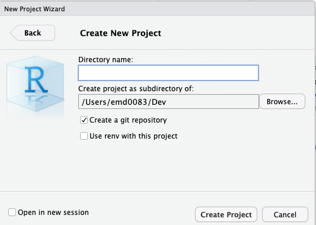

```{r, setup, include=FALSE}
knitr::opts_knit$set(root.dir = '~/Dev/Teaching R/crash_course_in_R')
```

# A Brief Introduction
R is a programming language that is commonly used for statistical analysis. When biologists talk about using R, most of the time we are using RStudio, which is a programming environment (like VSCode). RStudio is an *integrated development environment* which will make your R coding experience so much easier!

# Setting Up

**1.  Install R**

- Go to <https://cloud.r-project.org/> and choose the option for your operating system (OS). You want to download the latest release.

  - Mac: Click on the `.pkg` file that makes sense for your computer. You can check chip you have by hitting the Apple button and selecting 'About This Mac'. *(Most newer Macs will have a the Apple silicon chip.)*
  
  - Windows: Click `base` and then click on the link that says 'Download'.

**2. Open R from your computer.** This should open an interface that looks similar to the command line/ terminal.

  -   Don't move on until you have this launched and working!!!
  


**3.  Install RStudio**

  -   Go to <https://posit.co/download/rstudio-desktop/> and click on `Download RStudio Desktop for...`. This website should automatically detect your OS.

**4.  Launch RStudio.**

-   Congrats, you did it!

# Navigating RStudio
When you first launch RStudio, you should see three panes. Within each pane, there are different tabs which will show you various things. Feel free to look at the tabs yourself, but these are the most important ones...

- **Console** (left) - it should look like what you saw when you launched R. This is where you can access the 'Terminal' and 'Background Jobs'. For now, you will just stick to the default tab.

- **Environment, History...** (top-right) - 'Environment' will be everything that is currently loaded into your session of RStudio. The items in the environment are called 'Objects', but more on that later!

- **Files, Plots, Packages...** (bottom-right) - 'Files' shows you all the files on your computer and operates similarly to how you locate any files on your computer. 'Plots' is where graphics you generate will go. 'Packages' shows you all the packages you have at your disposal, but more on that later!

There are a lot of ways you can optimize your RStudio setup, like assigning themes and customizing your interface, but it's ok to stick to the defaults for now.

# Writing Code
There isn't a great way to save your work if you only code in the console. As scientists, we want our code to be reproducible, so the first step in that effort is to save our work! 

## Projects
Most places will teach you the basics of R without mentioning 'Projects'. A Project in RStudio is essentially a filing system for whatever you're working on.

**Benefits:**

- Keeps your work organized.

- Once you are ready to share your work with someone else, you can zip that folder and send it to someone else.


**Creating a project...**
1. *File > New Project*
2. Select 'New Directory'



3. Select 'R Project'

4. Enter the `Directory name:` and browse for `Create project as a subdirectory of:`--this is what your folder name will be and where it will be saved at. When you're ready, click 'Create Project'.



  - Don't worry about checking any other boxes for now. 


Now that you have a project, you should see the name you entered at the top right corner of RStudio. If you have multiple projects, let's say one is for class and one is for research, you can click on the project name up there and easily switch between the two.

## R Scripts vs. R Markdown
In RStudio, there are two easy ways we can accomplish this---using R-Script or R-Markdown. The choice between the two is mostly personal preference. I recommend learning by using R-Scripts before attempting R-Markdown.

>  **R-Script** (.R) are quick, easy to make, but documentation can be challenging. They also do not save the output as part of the file.

> **R-Markdown** (.Rmd) uses markdown in addition to R programming to render documents in more "readable" formats such as html, pdf, or Word. Any output can be included in the final document.

## Getting started with R Scripts
In RStudio, click on *File > New File > R Script*. This will open a new pane at the top-left of RStudio. 

Save your file. If you are in a project, the default location should be in the project folder. You can also create sub-folders if you want!

Any code you write in an R Script can be run directly in the console. Try entering some of the examples into your file. Then, with the cursor on that same line, hit the 'Run' button at the top right of the script pane. If you did it correctly, you should see an output in the console pane.

*Note: You can also use Command + Return (or Ctrl + Enter) to run the line of code that you have your cursor on.*

Remember how I mentioned that R Scripts aren't great for documentation? Well, you can actually use the pound sign (aka. hashtag) to start a comment. You don't need to end the comment, just go to a new line!

## Base Operators
```{r example-1}
10 - 7
```
R can handle other mathematical operators as well, like addition (+), multiplication (*), division (/), and even exponents (^). It also knows to follow the order of PEMDAS, so you don't need to worry about the results as long as you've written an equation correctly.
```{r}
1 * 4 ^ 2

1 * (4 ^ 2)
```
R can also use comparisons which you can use to get 'TRUE' or 'FALSE'.
> **<** less-than
> **>** greater-than
> **>=** greater than or equal to
> **<=** less than or equal to
> **==** equal to
> **!=** not equal to

```{r}
1 == 2

1 == 1
```

## Functions
R has a lot of built-in functions. These are pre-defined and may let the user determine arguments. The basic syntax is the function name followed by open and closing parenthesis. The arguments that can be defined by a user will be between the parentheses and separated by a comma (, ).

To figure out what a function does you can type '? ' before the function name in your console and hit enter. This pulls up the entry for the function in the 'Help' tab.

Let's say we want to find the mean (average) of 1, 3, 5, and 8. We could do it like this...
```{r}
1 + 3 + 5 + 8
17 / 4
```
Or we could use the function `mean()`. To use the function, we should probably know what goes into it, so try entering this in the console:
```{r eval=FALSE, include=TRUE}
? mean
```
We see that the usage is mean(x, ...). So, to use mean() we need to define x. The help page says x is "An *R* object*".

> **R Objects** are things that are saved to the environment. They can be vectors, matrices, lists, data frames, functions, etc.

First, we will combine our values (1, 3, 5, and 8) using the function `c()`. This can be saved by an object by typing an object name (no spaces allowed), using **<-** or **=**, and entering what will become assigned to that name.

*Please use **<-**, it is a lot easier to read especially as you start to do more complex coding.*
```{r}
# Combine values
c(1, 3, 5, 8)

# Notice, this doesn't save the values in the environment. 

# Save values as R object named 'test'
test <- c(1, 3, 5, 8)

# Check to see if your values were saved.
test
```
Now we know that 'test' has our value stored, so we can use mean().
```{r}
mean(test)
```
It is important to note that R functions can handle other functions inside of them. This can be handy in any case where you might not want to save extra objects to your environment. Here is an alternative for our scenario:
```{r}
mean(c(1, 3, 5, 8))
```
## Packages
R is open source, meaning that anyone can contribute. People who contribute make packages---these are groups of functions and/or datasets that help you accomplish something. Base R is very useful, but packages make the possibilities endless. 

Packages are available through CRAN (basically the "official" R source). There are also some packages on GitHub, but you aren't likely to need those unless you're doing something highly specific or experimental.

To download packages, you will use the function `install.packages()`. This loads it onto your machine. Each time you open R up, you will need to load the package into your session using `library()`.

One package you will use all the time is [ggplot2](https://ggplot2.tidyverse.org). This allows you to make amazing graphs and it's a whole lot easier to use than the plotting capabilities in base R!
```{r eval=FALSE, message=FALSE, include=TRUE}
# Install the package
install.packages("ggplot2")
```

```{r echo=TRUE}
# Load the package into the session
library(ggplot2)
```


## Importing Data
Most of the time, you will deal with data that have entered into a spreadsheet. Make sure you save as `.csv` (not the UTF-8 version!). 

To import the file into R, you will need to know the specific file path on your computer. I recommend finding the file in the 'Files' tab in RStudio, check the box, click 'More', then select 'Copy Folder Path to Clipboard'. On my computer, the file path is *~/Dev/Teaching R/assets* and the file name is *ecology_tutorial.csv*. So, the full file path is *~/Dev/Teaching R/assets/ecology_tutorial.csv*. The file path on your computer will be different!

> **ATTN: Windows users...** 
> Windows file paths, if you copy directly from File Exporer, will have backslashes '\'. You'll need to change these to forward slashes '/' when you use file paths in R.

Note that the first row in my file has the column names, so I will set the argument 'header' to equal TRUE.

```{r}
df <- read.csv(file = "~/Dev/Teaching R/crash_course_in_R/data/ecology_tutorial.csv", header = TRUE)

# Look at the data set in console
df
```

Now that you found data the hard way, I'll let you in on a little trick. If you're using an R Project and your data is saved inside the project, you can leave off the part of the file path that is your R project. For example, my R Project is located at "~/Dev/Teaching R" but my data is in a folder within that project called 'data'.

```{r}
df1 <- read.csv(file = "data/ecology_tutorial.csv", header = TRUE)

# Look at data in the console 
df1
```

If your data set is really big, you can check if it loaded correctly by using the function `head()` instead of just calling for the object.

```{r}
head(df)
```

# Summary
This crash course showed you the basics of R and RStudio. You should have a basic understanding of the difference between R and RStudio, navigation within RStudio, and writing R code.

